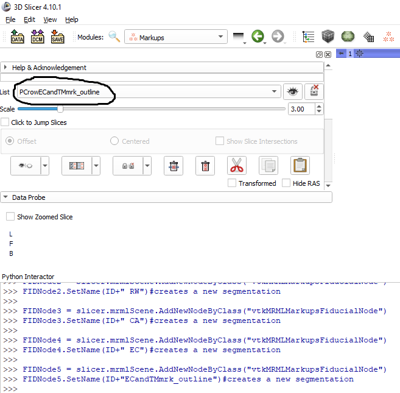

# 3D Slicer Automation Python Scripts
3D Slicer software has a [scripts repository](https://www.slicer.org/wiki/Documentation/Nightly/ScriptRepository) for automating procedures  using the software's built-in Python interpreter. Using these scripts greatly speeds up repetitive tasks for loading and processing volumes that would otherwires require repetative button-clicking the GUI while working through many files. 

This repository is a collection of Python scripts for running tasks in 3D Slicer 4.1 and Slicer 5+. 

##  Miscellaneous scripts:
|FileName|Purpose|
|--------|-------|
|*thickness.py*|compute segmentation thickness|
|*functions_baffle_planner* |model to segmentations and access segmentation logic|
|*load_dicom_modified_otsu.py*|load dicom and automatically run grayscale model maker using Otsu threshold. Can be run from command line using arguments for DICOM folder|
|*mirror.py*| use of SurfaceToolbox to transform/rotate model and use of model registration module within IGT|
|*elasitxreg_skullstripping_shnode.py*|running Elastix registration and skull stripping. organization in folders and export volumes, segmentation, and scene files|
|*commandl line_loopfolders_volume rendering.py*|using argparse run a custom volume rendering and screenshot export on all files in a folder|
|*2D slice_distance_thresh_outline.py* |specifying a current slice (specify red, green, or yellow axis), this hollows a segmentation to get a segmentation outline for two segmentations on that slice. then, extracts the numyp array to calculate the distances between two segmentation. Then, converting back to RAS coordinates, plost the outlines within a given distance of the other|
|*Crop volume using ROI.py* | automatation of crop volume module. Some investigation of dicom tags|
| *AIAA jun 17.py* | autosegmentation using nvidia AIAA|
| *XRAY batch_jun19.py* | apply median filter and mask volume segmentation effects. Draw text using opencv and imageio, save as png/jpg. Combine before and after images, sidebyside|
| *diploe_thickness_github.py* | apply segmentation effects, then run binary thinning and danielssondistance filters, to create a thickenss map using 'probe model with volume'|
| *diploe_pt2.py* | slice a model into 3D grid using dynamic modeler and using 'clean' from surface toolbox. Saving mean thickness to a text file. Batch process|
| *seg2thickness.py* | load segmentation for each folder, along with danielssondistance volume, to create a thickness map for each segmentation and save to a file|
| *radiomics2.py* | batch-run Radiomics module inside slicer and save results to excel files|

## 1. Some Example Usage

>* *1_set up volume and segmentation nodes.py*  - Populate markup nodes, also named according to unique IDs:
>* use fcsv_template() to set up fcsv names

>* *set resolution on previously saves scene.py* - 
If a scene file has previously been saved with those segmentation and markup nodes, the following script will allow for the python interpreter to have access to the previously created nodes:
>* There are several custom functions which are run on volume, which are defined in the 'staticfunction.py' file. This script includes the following functions:
 

#### **Segmentation functions:**  
>* **colthresh()** - run threshold on selected segment.
-sets the maximum entropy algorithm as minimum-
  
**colkeeplargestisland()** - runs the largest island on the 
thresholded columella
>* **ecd()** - sets the threshold on a segmented end of endosseous cochlear duct (uses all values less than maxent) (highlights soft tissues). Also runs keep largest island
>* **umbo_ME_ISOtest()** - runs a threshold test, but doesn't apply it. If the threshold
doesn't work, the user can modify manually using the GUI
>* **umbo_MES_ISO_apply()**- runs threshold test and applies it

#### **Markup functions:**  
>* **computedEC_TMmarkup()** - joins together points from multiple fcsv
objects, in order to later be used in markup-to-model which will cover an area encompassing points of intereset
>* **ETmarkuptomodel()** - runs the markup to model to create a region of interest
using the fcsv input

#### **Input/output functions:**  
>* **opennewvolume()** - given the path for a folder, it opens the first volume , or file containing "tif", and also sets the ID and spacing  
>* **writecolvoltofile()** - writes the columella volume to a file  
>* **fcsv_display_smaller()** - change the display of all the markup nodes and lock for editing

#### **Markups-to-models module to select segmentation region** 
>* The *4_markups to models.py* file uses the markup-to-models module to create a model from fcsv points. This 3D model can then be converted to a segmentation as a region of interest for further processing.

-it then converts the model to a segmentation, which can be edited using the normal segmentation effects:  

#### Importing data from a folder, setting resolutions
 
These set of scripts are for loading a volume, several fcsv files, and models from a single folder. This allows for loading components of interest without having to load all the segmentations. The scripts also format the color and opacity of the models and fcsv points
>* *volume.py* -   
    >>* load the volume in the folder.   
    >>* Also reads from a file the columella footplate or sets the plane to fit between 3 points along the columella.  
    >>* Exports a png file  
    >>* moves the plane through 3 points
>* *models.py*  
    >>* load the stl 3D files in the folder and adjust opacity, visibility and colour  
>* *fcsv.py*  
    >>* load the fcsv files and make them all black and of the correct size.  
    >>* Also uses the markups to model module to connect the fcsv points as models (The color and thickness of the models can be adjusted)  

#### Created gif of rotating 3D models and points:
>* *screencapture.py* -  creates a 3D rotation in the horizonal plane gif.

